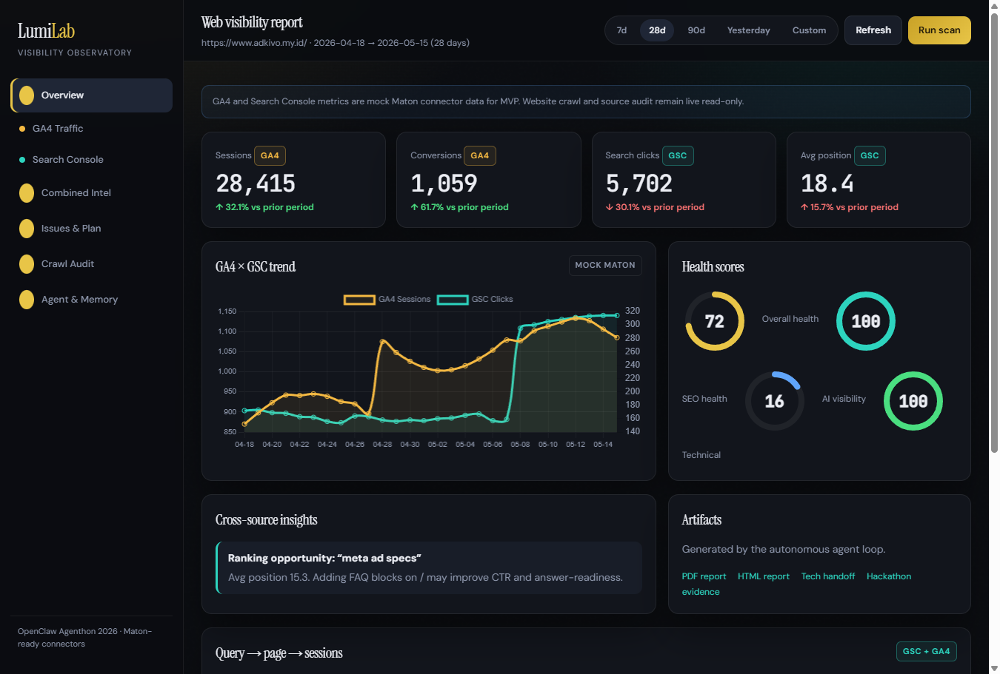
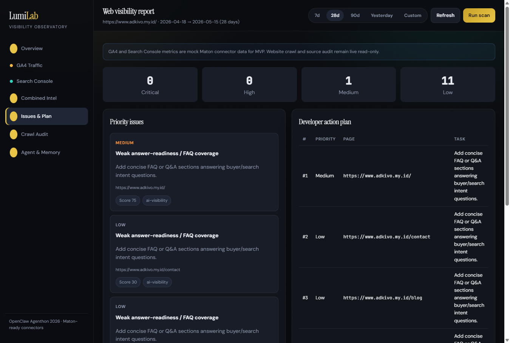
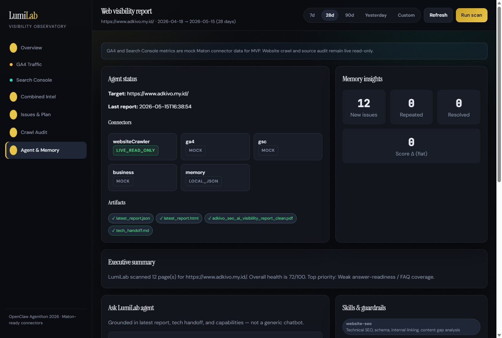
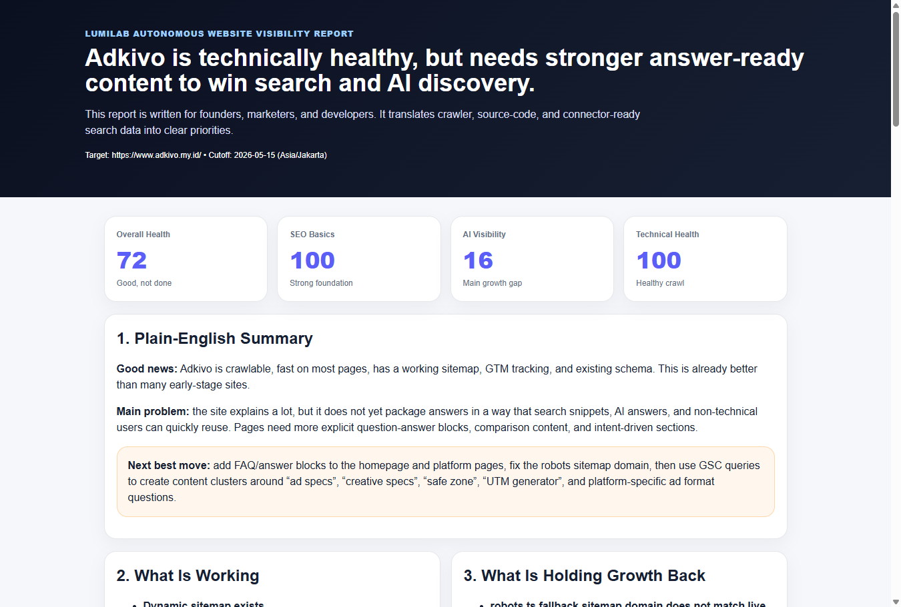
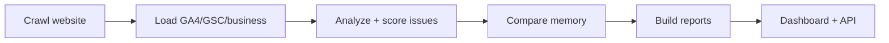

# LumiLab

**Autonomous website visibility agent** — crawl, score, remember, prioritize, and report. The dashboard is the surface; the agent does the work.

[](LICENSE)
[](https://nodejs.org/)
[](docs/HACKATHON_ALIGNMENT.md)
[](https://github.com/DyesDefalt/lumilab)

> **Repository:** [github.com/DyesDefalt/lumilab](https://github.com/DyesDefalt/lumilab)

## Screenshots

| Overview | Issues & action plan |
| --- | --- |
|  |  |

| Agent & memory | Human-readable report |
| --- | --- |
|  |  |

---

## What it does

LumiLab turns live website signals (plus optional analytics connectors) into **prioritized growth actions** — SEO, technical health, and AI/GEO answer-readiness — without editing your site by default.

| Dimension | What it checks |
| --- | --- |
| **SEO** | Titles, meta descriptions, H1 structure, alt text, thin content |
| **Technical** | HTTP status, crawlability, response issues |
| **AI / GEO** | Structured data, FAQ signals, trust markers |
| **Memory** | Day-over-day issue comparison and weekly trend |
| **Source audit** | Optional read-only Next.js repo checks (`TARGET_REPO_PATH`) |

**Scores:** 1–100 per dimension (100 = best). Overall is the average of SEO, AI visibility, and technical.

---

## Core loop

```text
Scan → Analyze → Remember → Prioritize → Report → Dashboard
```



---

## Tech stack

| Layer | Stack |
| --- | --- |
| Runtime | Node.js 18+ (ES modules) |
| Crawler | `fetch` + Cheerio (read-only) |
| API / UI | Express, static dashboard |
| Reports | JSON, Markdown, HTML, PDFKit |
| Executive PDFs | Python 3 + ReportLab (`scripts/*.py`) |
| Assistant | OpenAI-compatible API (BYOK, backend only) |
| Agent ops | OpenClaw cron + `skills/lumilab-visibility-agent/` |

---

## Project structure

```text
lumilab/
├── agent/                 # Analysis, scoring, memory, reports, source audit
├── connectors/            # Website crawler + GA4/GSC adapters
├── dashboard/             # Express API + public UI
├── mock-data/             # Brand-specific mock analytics (customize here)
├── memory/scans/          # Daily scan snapshots for trend comparison
├── output/                # Latest + dated reports (generated)
├── research/pagespeed/    # Optional speed fallback JSON for PDFs
├── scripts/               # scan, OpenClaw daily, PDF generators
├── skills/lumilab-visibility-agent/   # OpenClaw skill (copy to other workspaces)
└── docs/                  # Hackathon alignment, copy guide, agent prompts
```

---

## Prerequisites

- **Node.js** 18 or newer
- **npm**
- **Python 3** (optional, for bilingual / executive PDF packs)
- **Python packages** (for PDF scripts): `pip install reportlab pypdf`

---

## Install

### 1. Clone and install

```bash
git clone https://github.com/DyesDefalt/lumilab.git
cd lumilab
npm install
cp .env.example .env
```

### 2. Configure environment

Edit `.env` for your brand:

```bash
TARGET_SITE_URL=https://www.yourbrand.com/
CRAWL_LIMIT=10
DATA_MODE=mock
REPORT_TIMEZONE=Asia/Jakarta
PORT=3001

# Optional: dashboard “Ask the agent” (keys stay server-side)
OPENAI_API_KEY=
OPENAI_BASE_URL=https://api.openai.com/v1
OPENAI_MODEL=gpt-4o-mini

# Optional: read-only source audit (local path to site repo)
TARGET_REPO_PATH=

# Optional: live connectors via Maton (when ready)
MATON_API_KEY=
MATON_GA4_CONNECTION_ID=
MATON_GSC_CONNECTION_ID=
GA4_PROPERTY_ID=
GSC_SITE_URL=https://www.yourbrand.com/
```

### 3. Run a scan

```bash
npm run scan
```

### 4. Start the dashboard

```bash
npm run dashboard
```

Open **http://localhost:3001**

### 5. Optional — full PDF report pack

```bash
pip install reportlab pypdf
npm run scan
python3 scripts/generateBilingualReports.py
# or on Unix: bash scripts/runFullReportPack.sh
```

Regenerate README screenshots (dashboard must be running on `PORT`):

```bash
npm run dashboard
node scripts/captureReadmeScreenshots.js
```

---

## Commands

| Command | Description |
| --- | --- |
| `npm run scan` | Crawl target site, analyze, write reports + memory |
| `npm run openclaw:daily` | Autonomous daily loop (scan + validate outputs) |
| `npm run dashboard` | Dashboard UI + agent API on `PORT` |

---

## Implement for your brand

LumiLab ships with **Adkivo** as the reference implementation. To monitor **your** site, update these layers:

### A. Environment (required)

| Variable | Purpose |
| --- | --- |
| `TARGET_SITE_URL` | Site to crawl (live, read-only) |
| `CRAWL_LIMIT` | Max pages per scan |
| `REPORT_TIMEZONE` | Cutoff date for daily history |
| `TARGET_REPO_PATH` | Local clone of your frontend repo for source audit |
| `GSC_SITE_URL` | Search Console property when using live GSC |

### B. Mock analytics (MVP)

Until live Maton GA4/GSC is wired, scoring uses local mock data. Replace files under `mock-data/`:

| File | Customize |
| --- | --- |
| `business_signals.json` | `highValuePaths`, `primaryConversionPaths`, `market` |
| `ga4_yesterday.json` | Sessions, users, top pages (match your site) |
| `gsc_yesterday.json` | Queries, impressions, positions per path |

The crawler is **live**; GA4/GSC/business signals are **mock** until `DATA_MODE` and connectors are extended.

### C. PageSpeed fallback (optional PDF enrichment)

Add JSON under `research/pagespeed/` (see `adkivo_*.json` as templates). Bilingual PDF scripts read `adkivo_fallback_speed.json` if present — rename or duplicate for your brand slug.

### D. Branded PDF filenames

Python generators write executive PDFs with an `adkivo_` prefix, for example:

- `output/adkivo_daily_bilingual_visibility_report.pdf`
- `output/adkivo_weekly_bilingual_visibility_report.pdf`

Search `scripts/generateBilingualReports.py` and `scripts/generateDailyWeeklyReports.py` for `adkivo` and replace with your brand slug, or keep generic names like `brand_daily_visibility_report.pdf`.

### E. OpenClaw operator rules

Copy and edit `AGENT_LUMILAB.md` (target URL, schedule, output paths) for your autonomous agent. Use `docs/OPENCLAW_AGENT_PROMPT.md` for an approval-gated fix loop on a separate repo.

### F. Tech handoff copy

`agent/humanReport.js` builds developer markdown from scan + source audit. For fully white-label handoffs, adjust the template strings there to your product name and stack.

---

## Copy to another server or project

Three supported paths (details in [`docs/COPY_TO_ANOTHER_SERVER.md`](docs/COPY_TO_ANOTHER_SERVER.md)):

| Option | What to copy | Best for |
| --- | --- | --- |
| **A — Full repo** | `git clone` entire project | Fastest full setup |
| **B — OpenClaw skill only** | `skills/lumilab-visibility-agent/` | Existing OpenClaw workspace |
| **C — Agent modules** | `agent/`, `connectors/`, `scripts/`, `dashboard/` | Embedding in a Node monorepo |

**OpenClaw skill prompt example:**

```text
Use lumilab-visibility-agent to configure daily website visibility reports for https://example.com.
```

---

## Scoring logic

Each issue receives a **priority score**:

```text
score = severity × businessValue × trafficOpportunity × recurrenceFactor
```

| Priority | Score threshold |
| --- | --- |
| Critical | ≥ 141 |
| High | ≥ 81 |
| Medium | ≥ 41 |
| Low | < 41 |

Dimension scores (SEO, AI visibility, technical) start at 100 and apply penalties from detected issues. **Overall** is the rounded average of the three.

Issue types include: `technical`, `seo`, `accessibility-seo`, `ai-visibility`, `trust`, `content`.

---

## Outputs

After `npm run scan`:

| Artifact | Description |
| --- | --- |
| `output/latest_report.json` | Machine-readable report (dashboard source of truth) |
| `output/latest_report.md` | Markdown summary |
| `output/latest_report.html` | Styled HTML report |
| `output/latest_report.pdf` | PDF via PDFKit |
| `output/tech_handoff.md` | Developer implementation brief |
| `output/history/YYYY-MM-DD/` | Dated snapshot of the same artifacts |
| `memory/scans/YYYY-MM-DD.json` | Memory for comparisons and trends |

Optional Python-generated PDFs (bilingual daily/weekly, clean SEO deck) live under `output/` with brand-specific names.

---

## Dashboard API

Base URL: `http://localhost:PORT` (default `3001`)

| Endpoint | Method | Purpose |
| --- | --- | --- |
| `/api/latest-report` | GET | Latest JSON report |
| `/api/agent/status` | GET | Scores, file presence, capabilities |
| `/api/agent/capabilities` | GET | Skill manifest |
| `/api/agent/run-scan` | POST | Trigger `openclaw:daily` |
| `/api/agent/tech-handoff` | GET | Markdown handoff |
| `/api/assistant` | POST | Grounded Q&A (requires `OPENAI_API_KEY`) |
| `/api/analytics` | GET | Dashboard analytics presets |

Static assets: `dashboard/public/`. Reports served at `/output/`.

---

## Autonomous schedule (OpenClaw)

Recommended daily cron (adjust timezone in `.env`):

```bash
npm run openclaw:daily
python3 scripts/generateBilingualReports.py
```

The daily runner validates `latest_report.json`, `.md`, and `.pdf`, prints a console summary, and writes `output/error_report.json` on failure instead of failing silently.

---

## Guardrails

- **Read-only** website monitoring by default
- **No auto-fix or deploy** without explicit approval
- **Secrets** only in server `.env` — never exposed to the dashboard frontend
- **Mock data** is labeled in reports when connectors are not live
- Fix-loop agents: branch → patch → test → rescan → **ask before push/deploy**

---

## Documentation map

| Doc | Contents |
| --- | --- |
| [`docs/AGENT_CAPABILITIES.md`](docs/AGENT_CAPABILITIES.md) | Skills, tools, dashboard powers |
| [`docs/HACKATHON_ALIGNMENT.md`](docs/HACKATHON_ALIGNMENT.md) | OpenClaw Agenthon rubric mapping |
| [`docs/COPY_TO_ANOTHER_SERVER.md`](docs/COPY_TO_ANOTHER_SERVER.md) | Clone / skill / module copy paths |
| [`docs/OPENCLAW_AGENT_PROMPT.md`](docs/OPENCLAW_AGENT_PROMPT.md) | Approval-gated fix-loop prompt |
| [`skills/lumilab-visibility-agent/SKILL.md`](skills/lumilab-visibility-agent/SKILL.md) | OpenClaw skill reference |
| [`AGENT_LUMILAB.md`](AGENT_LUMILAB.md) | Operator rules for scheduled runs |

---

## Demo line

> The user only provides a website. LumiLab independently scans it, pulls search and analytics signals, checks source implementation, remembers previous scans, prioritizes issues, generates human and technical reports, and powers a dashboard assistant grounded in those artifacts.

---

## Sync with upstream

```bash
git pull origin main
npm install
```

---

## License

[MIT](LICENSE) © 2026 [DyesDefalt](https://github.com/DyesDefalt)

---

Built for **OpenClaw Agenthon 2026** · Reference target: [adkivo.my.id](https://www.adkivo.my.id/) · Agent operator: Clawdyes
